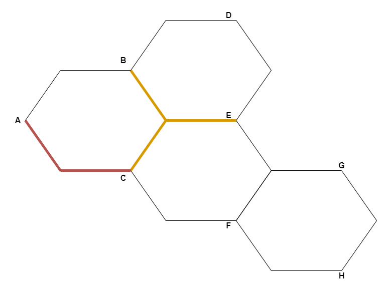

# Chemin le plus court

Ecrire un algorithme en pseudo code, permettant de trouver le chemin le plus court pour aller de A vers H

Les segments modélisent les seules routes qu'il est possible d'emprunter, en se déplaçant d'un point à un autre. Les segments colorés sont potentiellement FERMES.

Instructions à utiliser :
 - Aller de A vers B
 - Ecrire ...
 - Lire nom_variable
 - SI {CONDITION}
    - ALORS {INSTRUCTION}
    - SINON {INSTRUCTION}

Il n'est possible de demander l'état d'un segment qu'à partir d'un de ses côtés.
